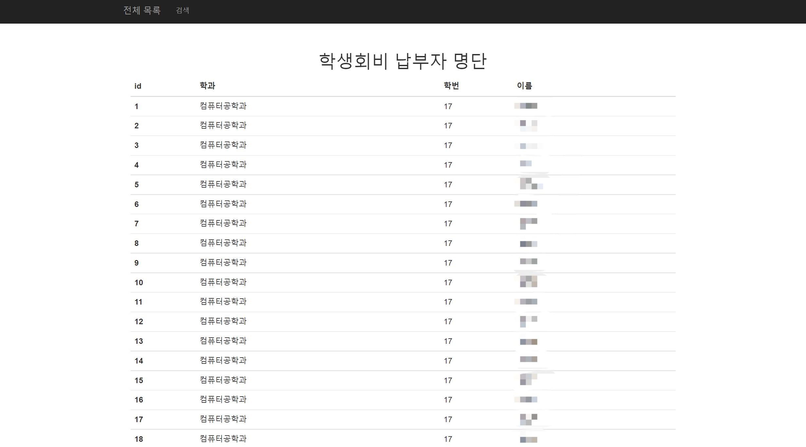
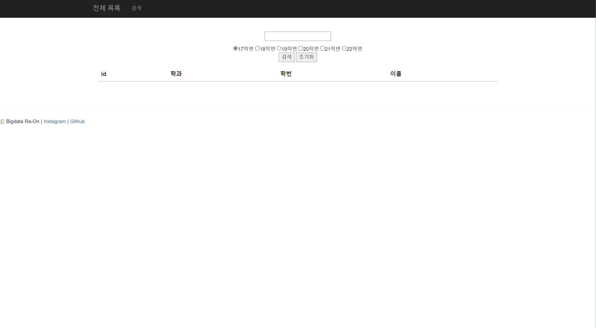
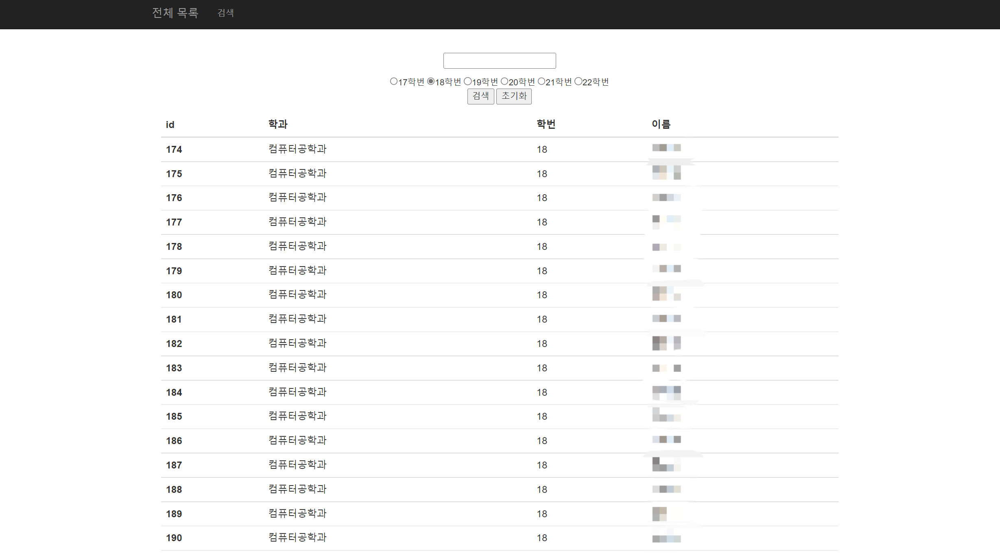
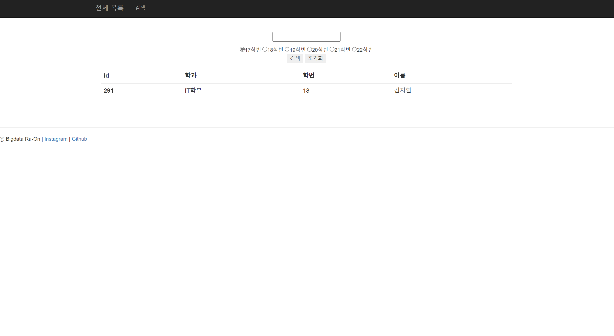

# Database_List_inquiry
Spring boot와 Mysql을 이용하여 Database 속 데이터를 조회하는 페이지 제작, 미니프로젝트
# 개요
&nbsp;평소 학생회 활동을 하면서 엑셀 데이터를 조회할 때가 잦다. 주로 사용하는 엑셀 파일을 웹페이지에서 바로 조회할 수 있으면 편하겠다는 생각이 들어 만들게 되었다.

## 개발 환경
* Java
> `11.0.16.1`
* Spring boot
> `2.6.8` Gradle Project   
> Spring data JPA   
> Lombok   
> Mustache   
> Spring Web   
> MySQL Driver
* IntelliJ
> IDEA Community Edition `2022.2.1`
* MySQL Server
> `8.0.30`

## 실행 요약

&nbsp;Spring boot 실행 시작했을 때 첫 메인 화면, 메인 화면인 전체 목록 탭을 보여준다.   
데이터베이스에 있는 입력 순번인 id와 각 학생들의 학과와 학번, 이름을 테이블 형식으로 보여준다.   

&nbsp;실행 후 상단 바에서 검색 탭으로 들어간 상황이다.   
검색 탭에서 검색 칸에 이름을 입력하고 검색하려는 학번을 골라서 검색하면 해당하는 row값이 데이터베이스에서 나와서 출력해준다.   

&nbsp;학번을 선택하고 이름없이 검색을 하면 학번에 따라 테이블 형태로 출력된다.

&nbsp;이름 입력 후, 학번 선택하고 검색하면 해당하는 학우의 정보가 뜨게 된다. 
